# Chrysopolis

[](https://builtwithnix.org)
[](https://github.com/byzantine-systems/chrysopolis/actions/workflows/build.yml)


> **CHRYSOPOLIS (Χρυσόπολις, lit. "Golden City")**, the name of at least two Byz. cities, one in Macedonia, the other in Bithynia. [^1]
>
> [^1]: The Oxford Dictionary of Byzantium, Vol I.

A verified foundation for BEAM applications, based on seL4, Nix and LionsOS.

## What is this?

Chrysopolis aims to run the BEAM on the [seL4 microkernel](https://sel4.systems/) via the [Microkit](https://github.com/seL4/microkit) framework and [LionsOS](https://github.com/au-ts/lionsos).

- **seL4** is a formally verified microkernel (~10k lines with machine-checked correctness proofs). It provides strong isolation guarantees, where each component runs in its own protection domain (PD), communicating via capabilities.
- **LionsOS** is a reference OS stack for seL4. It provides a musl-based libc, [sDDF drivers](https://trustworthy.systems/projects/drivers/) (serial, timer, block), and a cooperative cothread runtime [libmicrokitco](https://github.com/au-ts/libmicrokitco). Chrysopolis links ERTS against LionsOS `libc.a` (the same POSIX API, but backed by seL4 IPC instead of Linux syscalls).
- **Nix** is the build system and fetch/lock authority. 
    - A [flake-parts](https://flake.parts/)-structured flake (`flake.nix` + one module per concern under [modules/](modules)) cross-compiles ERTS, builds musl `libc.a` (autotools), and pins every input in `flake.lock`. 
    - **Zig** is invoked by Nix as the build driver via two `build.zig` metaprograms: 
        - [tools/sdf](tools/sdf) generates the Microkit system description.
        - the root [build.zig](build.zig) builds [libmicrokitco](https://github.com/au-ts/libmicrokitco), the sDDF driver/virtualiser PDs, and compiles and links the `beam_server` PD (ERTS glue) from [src/runtime](src/runtime). 
    - ERTS loads its OTP modules and boot script from a FAT filesystem (`fatfs` PD -> sDDF block subsystem), the result is a hermetic, reproducible `sel4-beam.img`.

## Architecture

```mermaid
flowchart LR
    %% Nodes
    App["Gleam / Erlang Application"]
    ERTS["ERTS 28.5<br/>(scheduler, GC, code loader)"]
    Runtime["Runtime Adapter<br/>(pthread -> cothreads, syscall stubs, FAT fs client)"]
    LionsOS["LionsOS<br/>(musl libc, sDDF serial/timer drivers, libmicrokitco)"]
    Microkit["Microkit<br/>(seL4 system init + IPC)"]
    seL4["seL4 Microkernel<br/>(formally verified)"]
    HW["AArch64<br/>(Cortex-A53 / qemu_virt)"]

    %% Flow/Stacking
    App ---> ERTS ---> Runtime ---> LionsOS ---> Microkit ---> seL4 ---> HW

    %% Style definitions for a clean, professional look
    style App fill:#E8F8F5,stroke:#1ABC9C,stroke-width:2px,color:#111
    style ERTS fill:#EBF5FB,stroke:#3498DB,stroke-width:2px,color:#111
    style Runtime fill:#EBF5FB,stroke:#3498DB,stroke-width:2px,color:#111
    style LionsOS fill:#F4ECF7,stroke:#9B59B6,stroke-width:2px,color:#111
    style Microkit fill:#F4ECF7,stroke:#9B59B6,stroke-width:2px,color:#111
    style seL4 fill:#FEF9E7,stroke:#F1C40F,stroke-width:2px,color:#111
    style HW fill:#EAEDED,stroke:#7F8C8D,stroke-width:2px,color:#111
```



## Development

### Nix Shell

```bash
# provides: qemu, erlang, gleam, aarch64 cross-compiler, make, zig, ...
nix develop     
# or
direnv allow
```

### Formatting

```bash
# nixfmt + gleam fmt + erlfmt + clang-format + zigfmt
nix fmt
```

### Testing

```bash
# All hermetic QEMU checks
nix flake check -L
# ...or one at a time:
nix build .#checks.x86_64-linux.boot-smoke -L
```

Five QEMU checks gate the build (each boots an image under emulation and asserts on the serial trace):

- **`boot-smoke`**: Headless boot of the ERTS image, asserts `beam_server` init, the sDDF monotonic clock, ERTS handoff, the FAT `MBR partitioning detected`, `Eshell`, and no PD faults.
- **`socket-smoke`**: Boots the bring-up image (no ERTS) and asserts the linked lwIP stack gets a DHCP lease and `socket()/bind()/listen()/connect()` succeed from C.
- **`shell-smoke`**: Drives the interactive Erlang shell under a pty (the Eshell only starts on a tty) and asserts that `> 1 + 1.` evaluates to `> 2.`.
- **`tcp-smoke`**: Drives the shell to prove `gen_tcp` both directions: a host client echoes off a guest listener, and the guest connects out to a host listener.
- **`rng-smoke`**: Boots the ERTS image twice and asserts the RNG fingerprint, `rand:bytes/1` and `erlang:make_ref/0` all differ across boots (see *Entropy* below).

### Running the BEAM shell

Build the ERTS-linked image:

```bash
nix build .#test-image                          
```
and boot it under QEMU using our custom (nix devenv) script:

```bash
run-sel4
```

After seL4 boots, you'll see the `beam_server` PD come up, the sDDF timer report a monotonic clock, ERTS hand off, and then the Erlang shell:

```text
warning: Git tree '/home/leto/Code/Personal/byzantine-systems/chrysopolis' is dirty
LDR|INFO: Setting all interrupts to Group 1
LDR|INFO: GICv2 ITLinesNumber: 0x00000008
LDR|INFO|CPU0: CurrentEL=EL2
LDR|INFO|CPU0: Resetting CNTVOFF
LDR|INFO: disabling MMU (if it was enabled)
LDR|INFO: PSCI version is 1.1
LDR|INFO: altloader for seL4 starting
LDR|INFO: flags:
             seL4 configured as hypervisor
LDR|INFO: kernel:      entry:   0x0000008060000000
LDR|INFO: root server: physmem: 0x0000000060246000 -- 0x0000000062713000
LDR|INFO:              virtmem: 0x0000000000200000 -- 0x00000000026cd000
LDR|INFO:              entry  : 0x0000000000221904
LDR|INFO: region: 0x00000000   addr: 0x0000000060000000   size: 0x0000000000246000   offset: 0x0000000000000000   type: 0x0000000000000001
LDR|INFO: region: 0x00000001   addr: 0x0000000060246000   size: 0x000000000000a304   offset: 0x0000000000246000   type: 0x0000000000000001
LDR|INFO: region: 0x00000002   addr: 0x0000000060260308   size: 0x0000000000013a08   offset: 0x0000000000250304   type: 0x0000000000000001
LDR|INFO: region: 0x00000003   addr: 0x0000000060283d10   size: 0x00000000000100b0   offset: 0x0000000000263d0c   type: 0x0000000000000001
LDR|INFO: region: 0x00000004   addr: 0x0000000060294000   size: 0x00000000001c8c1c   offset: 0x0000000000273dbc   type: 0x0000000000000001
LDR|INFO: region: 0x00000005   addr: 0x000000006045d000   size: 0x00000000022b6000   offset: 0x000000000043c9d8   type: 0x0000000000000001
LDR|INFO: copying region 0x00000000
LDR|INFO: copying region 0x00000001
LDR|INFO: copying region 0x00000002
LDR|INFO: copying region 0x00000003
LDR|INFO: copying region 0x00000004
LDR|INFO: copying region 0x00000005
LDR|INFO|CPU0: active CPUs to start: 0x00000001
LDR|INFO|CPU0: enabling MMU
LDR|INFO|CPU0: CurrentEL=EL2
LDR|INFO|CPU0: Resetting CNTVOFF
LDR|INFO|CPU0: enabling MMU
LDR|INFO|CPU0: jumping to kernel
Bootstrapping kernel
Warning: Could not infer GIC interrupt target ID, assuming 0.
available phys memory regions: 1
  [60000000..c0000000)
reserved virt address space regions: 2
  [8060000000..8060246000)
  [8060246000..8062713000)
Booting all finished, dropped to user space
INFO  [sel4_capdl_initializer::initialize] Starting CapDL initializer
INFO  [sel4_capdl_initializer::initialize] Starting threads
MON|INFO: Microkit Monitor started!
BLK_VIRT|INFO: sending MBR request
BLK_VIRT|INFO: initialising partitions
BLK_VIRT|INFO: MBR partitioning detected
MON|INFO: PD 'timer_driver' is now passive!
Begin input
'beam_server' is client 0
FAT filesystem mounted via fs_server.
Chrysopolis: beam_server up on the LionsOS reference stack.
monotonic clock via sDDF timer: 1.260051280 s
Handing off to ERTS core loop...
POSIX|ERROR: Unimplemented syscall number: 220
SOCKET_SMOKE|DHCP: 10.0.2.15
POSIX|ERROR: Unimplemented syscall number: 48
POSIX|ERROR: Unimplemented syscall number: 48
POSIX|ERROR: Unimplemented syscall number: 48
POSIX|ERROR: Unimplemented syscall number: 48
```

> [!NOTE]
> The `Unimplemented syscall` lines are **expected**, not failures: missing POSIX calls are mapped to `ENOSYS` so ERTS takes its user-space fallback path (risk) and continues to the shell.

At the `1>` prompt:

```erlang
Erlang/OTP 28 [erts-16.4.0.2] [source] [64-bit] [smp:1:1] [ds:1:1:10] [async-threads:1]

Eshell V16.4.0.2 (press Ctrl+G to abort, type help(). for help)
1> 1 + 1.
2
2> io:format("Hello from seL4!~n").
Hello from seL4!
ok
3> lists:seq(1, 5).
[1,2,3,4,5]
```

For testing the TCP/IP stack, prefer running the listener in a `spawn` so it doesn't block your shell, and keep the `accept -> recv -> send` hot path free of `io:format` :

> [!WARNING]
> Console writes cost ~1s each and can push the `echo` past `nc`'s timeout)

```erlang
spawn(fun() ->
  {ok, L} = gen_tcp:listen(8080, [ 
    binary, { packet, raw }, { active, false }, { reuseaddr, true } 
  ]),
  {ok, S} = gen_tcp:accept(L),
  {ok, B} = gen_tcp:recv(S, 0),
  gen_tcp:send(S, B),
  gen_tcp:close(S)
end).
```

and from the host:

```bash
echo hello | nc -N -w 3 localhost 8080
```

Outbound works too: `gen_tcp:connect({10,0,2,2}, Port, Opts)` reaches a service on the host. The `tcp-smoke` check exercises both directions automatically.

Press `Ctrl+G` for job control, `Ctrl+A` then `X` to exit QEMU.

> [!NOTE]
> **Quitting the shell doesn't stop QEMU.** `q().` (and any other ERTS exit) shuts ERTS down cleanly, but this is bare-metal seL4, there is no OS process to exit into and no power-off path, so the `beam_server` PD just parks (`beam_server: ERTS requested exit; parking PD.`) while the kernel keeps running its idle loop.
> 
> To actually terminate the emulator, use the QEMU monitor escape **`Ctrl+A` then `X`** (`Ctrl+A` then `C` toggles the monitor).
> 
> Making `q().` power the machine off would require routing a PSCI `SYSTEM_OFF` through the kernel/monitor, which a user PD can't issue directly under Microkit.
