# Chrysopolis

[](https://builtwithnix.org)


> **CHRYSOPOLIS (Χρυσόπολις, lit. "Golden City")**, the name of at least two Byz. cities, one in Macedonia, the other in Bithynia. [^1]
>
> [^1]: The Oxford Dictionary of Byzantium, Vol I.

A verified foundation for BEAM applications, based on NixOS and seL4.

## What is this?

Chrysopolis aims to run the BEAM on the [seL4 microkernel](https://sel4.systems/) via the [Microkit](https://github.com/seL4/microkit) framework and [LionsOS](https://github.com/au-ts/lionsos).

- **seL4** is a formally verified microkernel (~10k lines with machine-checked correctness proofs). It provides strong isolation guarantees, where each component runs in its own protection domain (PD), communicating via capabilities.
- **LionsOS** is a reference OS stack for seL4. It provides a musl-based libc, sDDF drivers (serial, timer, block), and a cooperative cothread runtime (`libmicrokitco`). Chrysopolis links ERTS against LionsOS `libc.a` (the same POSIX API, but backed by seL4 IPC instead of Linux syscalls).
- **Nix** is the build system and fetch/lock authority. 
    - A `flake.nix` cross-compiles ERTS, builds musl `libc.a` (autotools), and pins every input in `flake.lock`. 
    - **Zig** is invoked by Nix as the build driver via two `build.zig` metaprograms: 
        - [tools/sdf](tools/sdf) generates the Microkit system description.
        - the root [build.zig](build.zig) builds `libmicrokitco`, the sDDF driver/virtualiser PDs, and compiles and links the `beam_server` PD (ERTS glue) from [src/runtime](src/runtime). 
    - Boot files are embedded into memory (`memfs`), the result is a hermetic, reproducible `sel4-beam.img`.

## Architecture

```mermaid
flowchart LR
    %% Nodes
    App["Gleam / Erlang Application"]
    ERTS["ERTS 28.5<br/>(scheduler, GC, code loader)"]
    Runtime["Runtime Adapter<br/>(pthread -> cothreads, syscall stubs, memfs)"]
    LionsOS["LionsOS<br/>(musl libc, sDDF serial/timer drivers, libmicrokitco)"]
    Microkit["Microkit<br/>(seL4 system init + IPC)"]
    seL4["seL4 Microkernel<br/>(formally verified)"]
    HW["AArch64<br/>(Cortex-A53 / qemu_virt)"]

    %% Flow/Stacking
    App ---> ERTS ---> Runtime ---> LionsOS ---> Microkit ---> seL4 ---> HW

    %% Style definitions for a clean, professional look
    style App fill:#E8F8F5,stroke:#1ABC9C,stroke-width:2px,color:#111
    style ERTS fill:#EBF5FB,stroke:#3498DB,stroke-width:2px,color:#111
    style Runtime fill:#EBF5FB,stroke:#3498DB,stroke-width:2px,color:#111
    style LionsOS fill:#F4ECF7,stroke:#9B59B6,stroke-width:2px,color:#111
    style Microkit fill:#F4ECF7,stroke:#9B59B6,stroke-width:2px,color:#111
    style seL4 fill:#FEF9E7,stroke:#F1C40F,stroke-width:2px,color:#111
    style HW fill:#EAEDED,stroke:#7F8C8D,stroke-width:2px,color:#111
```



## Development

### Nix Shell

```bash
# provides: qemu, erlang, gleam, aarch64 cross-compiler, make, zig, ...
nix develop     
# or
direnv allow
```

### Formatting

```bash
# nixfmt + gleam fmt + erlfmt + clang-format + zigfmt
nix fmt
```

### Testing

```bash
# Hermetic boot-smoke test (QEMU headless)
nix build .#checks.x86_64-linux.boot-smoke -L
```

The `boot-smoke` check builds the image, boots it under QEMU (headless), and asserts three markers in the serial log:

1. `beam_server` up on the LionsOS reference stack (PD init success).
2. `monotonic clock` via sDDF timer (timer driver working).
3. Handing off to ERTS core loop (ERTS linked and launched).

### Running the BEAM shell

Build the ERTS-linked image:

```bash
nix build .#test-image                          
```
and boot it under QEMU with an **interactive** serial (`-serial mon:stdio`).

```bash
timeout 300 qemu-system-aarch64 \
  -machine virt,virtualization=on \
  -cpu cortex-a53 -m 2G -nographic \
  -serial mon:stdio \
  -device loader,file=result/sel4-beam.img,addr=0x70000000,cpu-num=0
```

After seL4 boots, you'll see the `beam_server` PD come up, the sDDF timer report a
monotonic clock, ERTS hand off, and then the Erlang shell:

```text
Chrysopolis: beam_server up on the LionsOS reference stack.
monotonic clock via sDDF timer: 0.667284592 s
Handing off to ERTS core loop...
POSIX|ERROR: Unimplemented syscall number: 78
POSIX|ERROR: Unimplemented syscall number: 220
POSIX|ERROR: Unimplemented syscall number: 198
POSIX|ERROR: Unimplemented syscall number: 209
Erlang/OTP 28 [erts-16.4.0.1] [source] [64-bit] [smp:1:1] [ds:1:1:10] [async-threads:1]

Eshell V16.4.0.1 (press Ctrl+G to abort, type help(). for help)
1>
```

> The `Unimplemented syscall` lines are **expected**, not failures: missing POSIX
> calls are mapped to `ENOSYS` so ERTS takes its user-space fallback path (risk) 
> and continues to the shell.

At the `1>` prompt:

```erlang
1> 1 + 1.
2
2> io:format("Hello from seL4!~n").
Hello from seL4!
ok
3> lists:seq(1, 5).
[1,2,3,4,5]
```

Press `Ctrl+G` for job control; `Ctrl+A` then `X` to exit QEMU.
