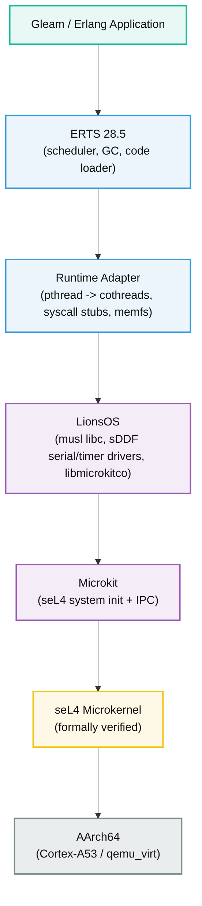

# Chrysopolis

[](https://builtwithnix.org)


> **CHRYSOPOLIS (Χρυσόπολις, lit. "Golden City")**, the name of at least two Byz. cities, one in Macedonia, the other in Bithynia. [^1]
>
> [^1]: The Oxford Dictionary of Byzantium, Vol I.

A (WIP) verified foundation for BEAM applications, based on NixOS and seL4.

## What is this?

Chrysopolis aims to run the BEAM on the [seL4 microkernel](https://sel4.systems/) via the [Microkit](https://github.com/seL4/microkit) framework and [LionsOS](https://github.com/au-ts/lionsos).

- **seL4** is a formally verified microkernel (~10k lines with machine-checked correctness proofs). It provides strong isolation guarantees, where each component runs in its own protection domain (PD), communicating via capabilities.
- **LionsOS** is a reference OS stack for seL4. It provides a musl-based libc, sDDF drivers (serial, timer, block), and a cooperative cothread runtime (`libmicrokitco`). Chrysopolis links ERTS against LionsOS `libc.a` (the same POSIX API, but backed by seL4 IPC instead of Linux syscalls).
- **Nix** is the build system. A `flake.nix` cross-compiles ERTS, builds the LionsOS reference stack, generates the Microkit system description from a Zig metaprogram, embeds boot files into memory (`memfs`), and produces a bootable `sel4-beam.img`. Every input is pinned in `flake.lock`, builds are hermetic and reproducible.

## Quick start

```bash
nix develop                                     
# or
direnv allow
```

Then cross-compile everything:

```bash
nix build .#test-image                          
timeout 300 qemu-system-aarch64 \
  -machine virt,virtualization=on \
  -cpu cortex-a53 -m 2G -nographic \
  -serial mon:stdio \
  -device loader,file=result/sel4-beam.img,addr=0x70000000,cpu-num=0
```

## Architecture



## Development

### Nix Shell

```bash
# provides: qemu, erlang, gleam, aarch64 cross-compiler, make, zig, ...
nix develop     
# or
direnv allow
```

### Build Targets

```bash
# full bootable image with ERTS + memfs
nix build .#test-image
# beam_test.elf only
nix build .#beam-test
# Gleam bytecode only
nix build .#app
# system description only
nix build .#sdf         
# LionsOS reference stack
nix build .#lions-stack 
# static ERTS archive
nix build .#liberts     
```

### Formatting

```bash
# nixfmt + gleam fmt + erlfmt + clang-format + zigfmt
nix fmt
```

### Testing

```bash
# Gleam tests (not on seL4)
gleam test               
# Hermetic boot-smoke test (QEMU headless)
nix flake check           
```

The `boot-smoke` check builds the image, boots it under QEMU, and asserts three
markers in the serial log:

1. `beam_server` up on the LionsOS reference stack (PD init success).
2. `monotonic clock` via sDDF timer (timer driver working).
3. Handing off to ERTS core loop (ERTS linked and launched).

### Validating the Erlang REPL

The boot-smoke check proves ERTS is present and starts. To verify the
interactive shell (requires a terminal):

```bash
nix build .#test-image
timeout 300 qemu-system-aarch64 \
  -machine virt,virtualization=on \
  -cpu cortex-a53 -m 2G -nographic \
  -serial mon:stdio \
  -device loader,file=result/sel4-beam.img,addr=0x70000000,cpu-num=0
```

At the `1>` prompt:

```erlang
1> 1 + 1.
2
2> io:format("Hello from seL4!~n").
Hello from seL4!
ok
3> lists:seq(1, 5).
[1,2,3,4,5]
```

Press `Ctrl+G` for job control, `Ctrl+A X` to exit QEMU.
